# Analysis of world economies and GDP rankings
Manjula Kottegoda  
June 20, 2016  


###Abstract:  
This Article investigates data^1^ published by the World Bank to look at relationships between world’s nations on GDP^2^ rankings and income groups based on OECD^3^ membership and provide insight into the wealth distribution across the world.


Firstly we will examine the data itself and do some analysis to make sure the data is of good quality for this study. 


```r
# -------------------------------------------------------------------------------
# 1. First we load the Education statis datafile in to a dataframe
# 2. Do a quick view in to the Education data frame
# 3. Load the Ranking datafile to anoter dataframe
# 4. Do a quick view in to the Ranking data frame
# -------------------------------------------------------------------------------
EduRaw <- read.csv("Analysis/Data/EDSTATS_Country.csv",blank.lines.skip=TRUE,colClasses="character")
str(EduRaw)
```

```
## 'data.frame':	234 obs. of  31 variables:
##  $ CountryCode                                      : chr  "ABW" "ADO" "AFG" "AGO" ...
##  $ Long.Name                                        : chr  "Aruba" "Principality of Andorra" "Islamic State of Afghanistan" "People's Republic of Angola" ...
##  $ Income.Group                                     : chr  "High income: nonOECD" "High income: nonOECD" "Low income" "Lower middle income" ...
##  $ Region                                           : chr  "Latin America & Caribbean" "Europe & Central Asia" "South Asia" "Sub-Saharan Africa" ...
##  $ Lending.category                                 : chr  "" "" "IDA" "IDA" ...
##  $ Other.groups                                     : chr  "" "" "HIPC" "" ...
##  $ Currency.Unit                                    : chr  "Aruban florin" "Euro" "Afghan afghani" "Angolan kwanza" ...
##  $ Latest.population.census                         : chr  "2000" "Register based" "1979" "1970" ...
##  $ Latest.household.survey                          : chr  "" "" "MICS, 2003" "MICS, 2001, MIS, 2006/07" ...
##  $ Special.Notes                                    : chr  "" "" "Fiscal year end: March 20; reporting period for national accounts data: FY." "" ...
##  $ National.accounts.base.year                      : chr  "1995" "" "2002/2003" "1997" ...
##  $ National.accounts.reference.year                 : chr  "" "" "" "" ...
##  $ System.of.National.Accounts                      : chr  "" "" "" "" ...
##  $ SNA.price.valuation                              : chr  "" "" "VAB" "VAP" ...
##  $ Alternative.conversion.factor                    : chr  "" "" "" "1991-96" ...
##  $ PPP.survey.year                                  : chr  "" "" "" "2005" ...
##  $ Balance.of.Payments.Manual.in.use                : chr  "" "" "" "BPM5" ...
##  $ External.debt.Reporting.status                   : chr  "" "" "Actual" "Actual" ...
##  $ System.of.trade                                  : chr  "Special" "General" "General" "Special" ...
##  $ Government.Accounting.concept                    : chr  "" "" "Consolidated" "" ...
##  $ IMF.data.dissemination.standard                  : chr  "" "" "GDDS" "GDDS" ...
##  $ Source.of.most.recent.Income.and.expenditure.data: chr  "" "" "" "IHS, 2000" ...
##  $ Vital.registration.complete                      : chr  "" "Yes" "" "" ...
##  $ Latest.agricultural.census                       : chr  "" "" "" "1964-65" ...
##  $ Latest.industrial.data                           : chr  "" "" "" "" ...
##  $ Latest.trade.data                                : chr  "2008" "2006" "2008" "1991" ...
##  $ Latest.water.withdrawal.data                     : chr  "" "" "2000" "2000" ...
##  $ X2.alpha.code                                    : chr  "AW" "AD" "AF" "AO" ...
##  $ WB.2.code                                        : chr  "AW" "AD" "AF" "AO" ...
##  $ Table.Name                                       : chr  "Aruba" "Andorra" "Afghanistan" "Angola" ...
##  $ Short.Name                                       : chr  "Aruba" "Andorra" "Afghanistan" "Angola" ...
```

```r
GDPRaw <- read.csv("Analysis/Data/GDP.csv",blank.lines.skip=TRUE,colClasses="character")
str(GDPRaw)
```

```
## 'data.frame':	240 obs. of  6 variables:
##  $ X                          : chr  "" "" "" "" ...
##  $ Gross.domestic.product.2012: chr  "" "" "Ranking" "" ...
##  $ X.1                        : chr  "" "" "" "" ...
##  $ X.2                        : chr  "" "" "Economy" "" ...
##  $ X.3                        : chr  "" "(millions of" "US dollars)" "" ...
##  $ X.4                        : chr  "" "" "" "" ...
```

Initial view of the data shows that some cleanup is necessary for the analysis to proceed. Hence we perform the following steps to clean the GDP ranking data. First remove unnecessary columns & rows then give the resulting data frame meaningful column names. After which we will take a quick look at the cleaned data to confirm the changes.


```r
# Note: The Ranking data will be manipulated using a copy (GDPTemp) of the origibnal data 
#--------------------------------------------------------------
# Clean up columns in two steps
#--------------------------------------------------------------
# 1. Drop empty columns
GDPTemp <- GDPRaw[!sapply(GDPRaw, function(x) all(x == ""))]
# 2. Drop non empty but Junk column number #5
GDPTemp <- GDPTemp[,-c(5)]


#--------------------------------------------------------------
# Clean up Rows in two steps
#--------------------------------------------------------------
# 1.conditianally remove rows based on vital elements of data not being populated
GDPTemp<-GDPTemp[!(GDPTemp$X=="" & GDPTemp$X.2==""),]
# 2. Clean up residual titles segments 
GDPTemp<-GDPTemp[!(GDPTemp[2] == "Ranking"),]

#--------------------------------------------------------------
#setup new meaningful comumn headers
#--------------------------------------------------------------
names(GDPTemp) <- c("CountryCode","GDPrank","Economy","GDPmillionsUSD")

#head(GDPTemp, 5) #look at the first 5 rows
str(GDPTemp)
```

```
## 'data.frame':	228 obs. of  4 variables:
##  $ CountryCode   : chr  "USA" "CHN" "JPN" "DEU" ...
##  $ GDPrank       : chr  "1" "2" "3" "4" ...
##  $ Economy       : chr  "United States" "China" "Japan" "Germany" ...
##  $ GDPmillionsUSD: chr  "16,244,600" "8,227,103" "5,959,718" "3,428,131" ...
```

As apparent the GDP (given in millions USD) and the GDP Rank needs to be converted to integers.


```r
#-------------------------------------------------------------
# Perform data conversions
#-------------------------------------------------------------
# 1. set Rank as Numeric
GDPTemp$GDPrank <- as.integer(GDPTemp$GDPrank)

# 2. set GDPamount-Column Name GDPmillionsUSD as Numeric
GDPTemp$GDPmillionsUSD <- gsub(",", "", GDPTemp$GDPmillionsUSD) # weed out commas first
GDPTemp$GDPmillionsUSD <- suppressWarnings(as.integer(GDPTemp$GDPmillionsUSD))

str(GDPTemp) # taking another quick look to confirm GDPmillionsUSD and GDPrank data types
```

```
## 'data.frame':	228 obs. of  4 variables:
##  $ CountryCode   : chr  "USA" "CHN" "JPN" "DEU" ...
##  $ GDPrank       : int  1 2 3 4 5 6 7 8 9 10 ...
##  $ Economy       : chr  "United States" "China" "Japan" "Germany" ...
##  $ GDPmillionsUSD: int  16244600 8227103 5959718 3428131 2612878 2471784 2252664 2014775 2014670 1841710 ...
```

```r
sum(is.na(GDPTemp$GDPrank)) # number of NA values on Rankings column
```

```
## [1] 38
```

```r
sum(is.na(GDPTemp$GDPmillionsUSD)) # number of NA values on GDP value column
```

```
## [1] 24
```

Now we can see that there are 38 rows with no rankings Of which 24 rows are missing GDP values as well. When the GDP data is missing the ranking by default becomes empty. The list of countries with missing GDP data (GDPmillionsUSD) that will be  omitted from this study is listed below for informational purposes.


```r
kable(GDPTemp[(is.na(GDPTemp$GDPmillionsUSD)),], padding=0)
```

     CountryCode  GDPrank  Economy                    GDPmillionsUSD
---  -----------  -------  -------------------------  --------------
196  ASM               NA  American Samoa                         NA
197  ADO               NA  Andorra                                NA
198  CYM               NA  Cayman Islands                         NA
199  CHI               NA  Channel Islands                        NA
200  CUW               NA  Curaçao                                NA
201  DJI               NA  Djibouti                               NA
202  FRO               NA  Faeroe Islands                         NA
203  PYF               NA  French Polynesia                       NA
204  GRL               NA  Greenland                              NA
205  GUM               NA  Guam                                   NA
206  IMY               NA  Isle of Man                            NA
207  PRK               NA  Korea, Dem. Rep.                       NA
208  LBY               NA  Libya                                  NA
209  LIE               NA  Liechtenstein                          NA
210  MMR               NA  Myanmar                                NA
211  NCL               NA  New Caledonia                          NA
212  MNP               NA  Northern Mariana Islands               NA
213  SMR               NA  San Marino                             NA
214  SXM               NA  Sint Maarten (Dutch part)              NA
215  SOM               NA  Somalia                                NA
216  MAF               NA  St. Martin (French part)               NA
217  TCA               NA  Turks and Caicos Islands               NA
218  VIR               NA  Virgin Islands (U.S.)                  NA
219  WBG               NA  West Bank and Gaza                     NA

After removing the data with empty rankings we will create a new dataframe that will contain all countries with ranking and GDP values populated.


```r
#---------------------------------------------------------------
# Three data frames are defined in code below - Creating the three dataframes is for future analysis 
#  1. Regional and grouped data  (Contain world and Income segment data) in GDP_Region
#  2. All rows with a csingle ounntry or teritory in GDP_nonRegion
#  3. Countries with GDP data popalated in GDP_nonRegion_Datacomplete
#---------------------------------------------------------------
# 1. Get Non-Country subset (World, South Asia etc)
GDP_Region<-GDPTemp[is.na(GDPTemp$GDPrank) & (!is.na(GDPTemp$GDPmillionsUSD)),]


#2. Build  subset of rows that do not have regions (there are countries and teritories i.e. American Samoa here)
GDP_nonRegion <- GDPTemp[!GDPTemp$CountryCode %in% GDP_Region$CountryCode,]


#3 Build Country list with data populated in GDP rank and GDP Millions
GDP_nonRegion_Datacomplete <- GDP_nonRegion[!is.na(GDP_nonRegion$GDPrank),]
```

A quick glance at the data sorted by lowest rank (poorest) to highest (wealthiest) for the 15 poorest economies show a tie for 12^th^. Therefore there is no 13^th^ place as there is a tie for 12^th^ between Grenada and St.Kitts & Nevis.


```r
head(GDP_nonRegion_Datacomplete[order(rev(GDP_nonRegion_Datacomplete$GDPrank)),], 15)
```

```
##     CountryCode GDPrank                        Economy GDPmillionsUSD
## 194         TUV     190                         Tuvalu             40
## 193         KIR     189                       Kiribati            175
## 192         MHL     188               Marshall Islands            182
## 191         PLW     187                          Palau            228
## 190         STP     186          São Tomé and Principe            263
## 189         FSM     185          Micronesia, Fed. Sts.            326
## 188         TON     184                          Tonga            472
## 187         DMA     183                       Dominica            480
## 186         COM     182                        Comoros            596
## 185         WSM     181                          Samoa            684
## 184         VCT     180 St. Vincent and the Grenadines            713
## 183         KNA     178            St. Kitts and Nevis            767
## 182         GRD     178                        Grenada            767
## 181         VUT     177                        Vanuatu            787
## 180         GNB     176                  Guinea-Bissau            822
```

Now the data from the GDP Ranking data is merged with the Education data.


```r
#---------------------------------------------------------------------------
#  The clean data rich dafatrame GDP_nonRegion_Datacomplete is now merged with EduRaw dataframe 
#  matched by CountryCode 
#---------------------------------------------------------------------------
TempMerge <-  merge(GDP_nonRegion_Datacomplete,EduRaw,by="CountryCode")
nrow(TempMerge)
```

```
## [1] 189
```


As can be seen 189 countries IDs matched in the merge. Now we look at the average GDP rankings for the Income Groups.


```r
#-----------------------------------------------------------------------------------------
# Code below will apply the average function with the appropriate Income group filter
#-----------------------------------------------------------------------------------------
#Average GDP Rank for the "High income: OECD" and "High income: nonOECD" groups? 
RankAvgByIncomeGroup<-tapply(TempMerge$GDPrank,TempMerge$Income.Group,mean)
RankAvgByIncomeGroup
```

```
## High income: nonOECD    High income: OECD           Low income 
##             91.91304             32.96667            133.72973 
##  Lower middle income  Upper middle income 
##            107.70370             92.13333
```

We can observe that GDP rankings for the Income group: "High income: OECD"^4^ is 92 and Income group: "High income: nonOECD"^5^ is 33. OECD membership, which fosters structure and economic corporation  between nations, seems to have a noticeable impact to a country's GDP ranking.


Now we look at GDP ranking visually in an all in one graph. While the graph is busy it gives an idea on disparities, outliers and a general view of overall global wealth distribution. The outlier in the far left is the United States.


```r
GDPCountryPlot <- data.frame(TempMerge[,c("GDPmillionsUSD","Economy","Income.Group")])
options(scipen=10000)
g<-ggplot(GDPCountryPlot, aes(x= Economy,y=GDPmillionsUSD,  colour = factor(Income.Group)))+geom_point()
g<-g+xlab("Country") + ylab("GDP in Millions usd")+ggtitle('GDP for all countries')
g<-g+theme(axis.text.x=element_text(angle=90, hjust=1,vjust=0.2),axis.text=element_text(size=7),legend.position = "bottom",legend.background = element_rect(colour = "black"),legend.text = element_text(size = 15))
g
```

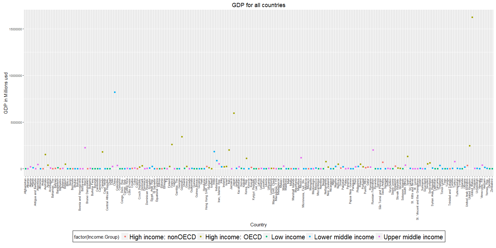<!-- -->

We will now look at the GDP by Income Groups to show distributions within groups.


```r
# Code generating the additional plots are in this scrit file ggplots_code.R
source('Analysis/ggplots_code.R') 

p1 # show plot 1 - Low income group
```

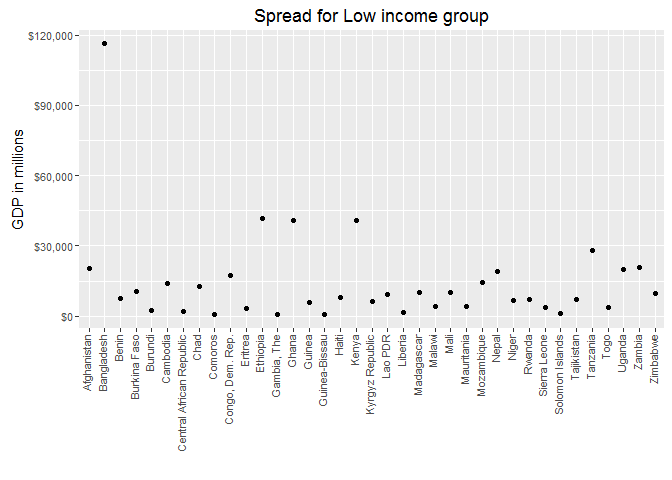<!-- -->

```r
p2 # show plot 2 - Low middle income group
```

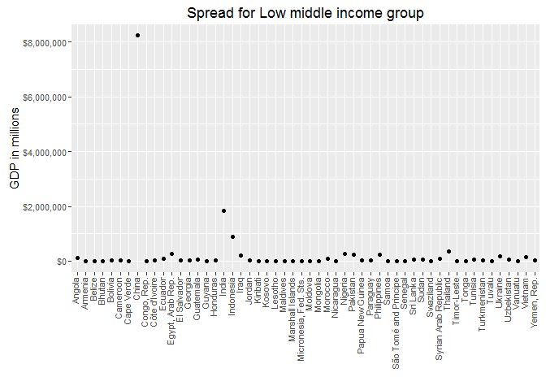<!-- -->

```r
p3 # show plot 3 - Upper middle income group
```

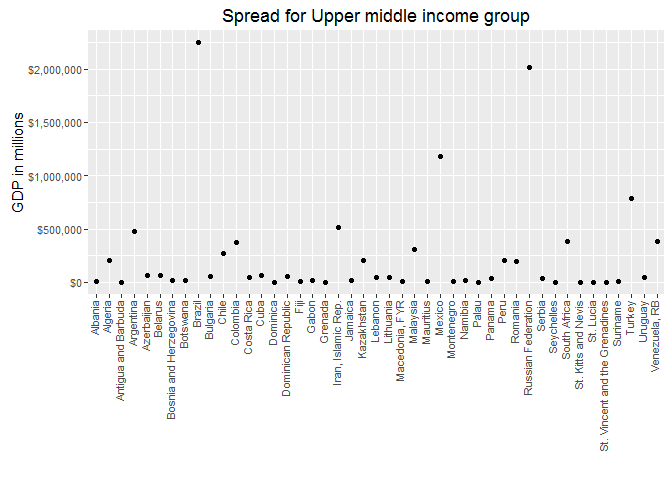<!-- -->

```r
p4 # show plot 4 - High income non OECD income group
```

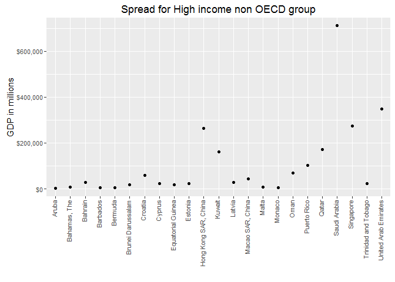<!-- -->

```r
p5 # show plot 5 - High Income OECD income group
```

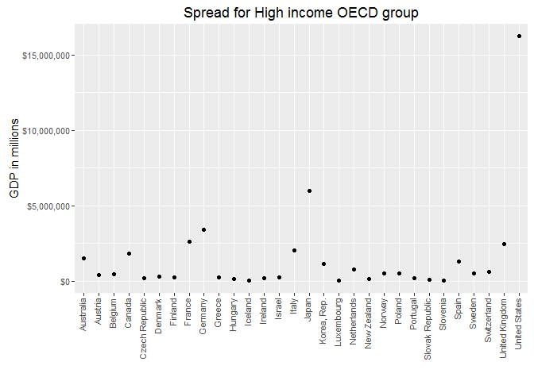<!-- -->
 
In the plots above it's important to pay attention to the scale on the Y-axis. For readability the scale is not kept uniform between the plots. Another point of interest is how China and India, while having high GDPs, fall into the Low middle income category because of very high populations.


We now look at a different view of the GDP data by geographically mapping the different groups. Colors within a single map shows the GDP as red for higher-end and yellow for lower-end values in the group.


```r
#Note: Code generating the world maps are located in file Analysis/mapplots.R
```

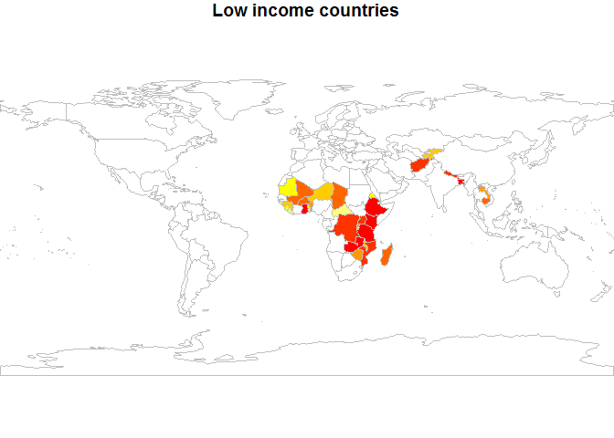<!-- -->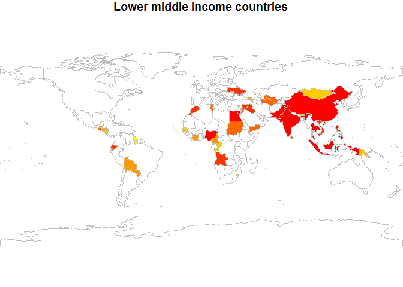<!-- -->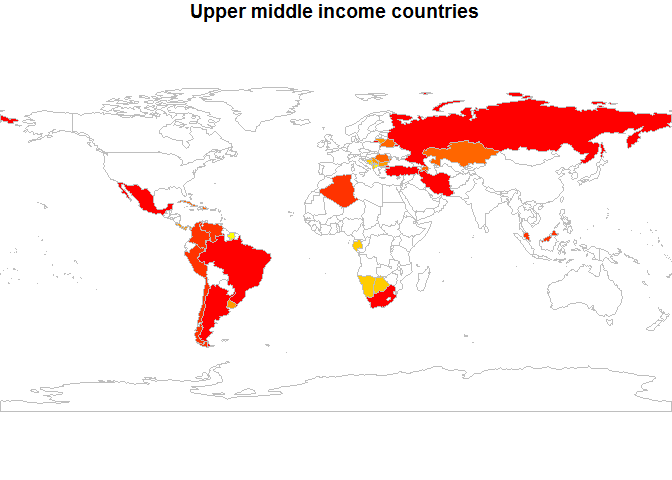<!-- -->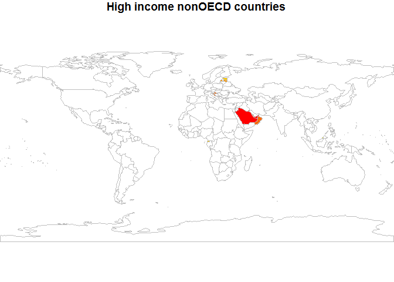<!-- -->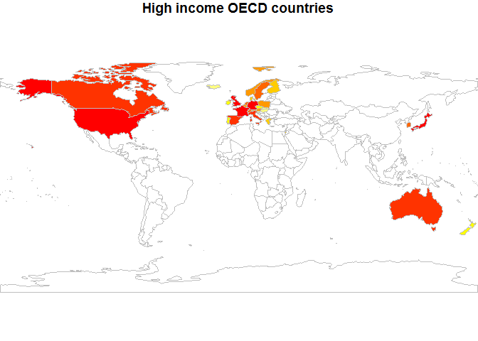<!-- -->

We now divide the GDP ranking into 5 separate quantile groups. 


```r
#---------------------------------------------------------------------------------------
# Cut the GDP ranking into 5 separate quantile groups. 
#---------------------------------------------------------------------------------------

Rank_IncomeGrp <- data.frame(TempMerge[,c("GDPrank","Income.Group")])
quantileDF <- quantile(TempMerge$GDPrank,probs = c(0,0.2,0.4,0.6,0.8,1))
head(quantileDF)
```

```
##    0%   20%   40%   60%   80%  100% 
##   1.0  38.6  76.2 113.8 152.4 190.0
```

And make a table versus Income Group.


```r
# ---------------------------------------------------------------------------------------
# Make a table versus Income.Group. 
#---------------------------------------------------------------------------------------

TempMerge$Rankquantile <- cut(TempMerge$GDPrank, breaks = quantileDF)
T1 <- table(TempMerge$Rankquantile, TempMerge$Income.Group)
T1
```

```
##              
##               High income: nonOECD High income: OECD Low income
##   (1,38.6]                       4                17          0
##   (38.6,76.2]                    5                10          1
##   (76.2,114]                     8                 1          9
##   (114,152]                      4                 1         16
##   (152,190]                      2                 0         11
##              
##               Lower middle income Upper middle income
##   (1,38.6]                      5                  11
##   (38.6,76.2]                  13                   9
##   (76.2,114]                   11                   8
##   (114,152]                     9                   8
##   (152,190]                    16                   9
```


As can be seen 5 countries are rated lower middle income while being among the 38 nations with the highest GDP. This shows that the GDP ranking plays a lesser role in a country’s income grouping while its population plays greater role. 

United States is by far the wealthiest country and all other advanced nations enjoy a high incomes. On the opposite side of the spectrum there seems to be a high concentration of central African countries in the lowest bracket with western sub-saharan countries faring the worst. 

--------------------------------------------------------------------------------

data^1^ – 
Data used in the analysis were gathered from the following sources
    <http://data.worldbank.org/data-catalog/GDP-ranking-table>
    <http://data.worldbank.org/data-catalog/ed-stats>


GDP^2^ : GDP is the sum of gross value added by all resident producers in the economy plus any product taxes and minus any subsidies not included in the value of the products. It is calculated without making deductions for depreciation of fabricated assets or for depletion and degradation of natural resources. Data are in current U.S. dollars.


OECD^3^ -  The Organization for Economic Co-operation and Development   
see <http://www.oecd.org/about>


High income: OECD^4^ - see <http://data.worldbank.org/income-level/OEC>

High income: nonOECD^5^ - see <http://data.worldbank.org/income-level/NOC>

